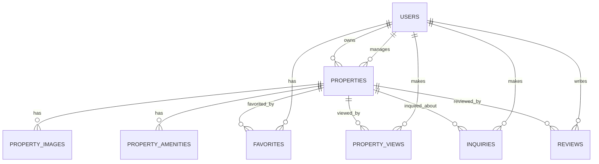

# 🏠 Vesta Nest - Ghana's Premier Real Estate Platform

<div align="center">


_Discover exceptional properties across Ghana with our innovative platform. Experience modern living with elegance, comfort, and style._

[🚀 Live Demo](#) • [📖 Documentation](#) • [🤝 Contributing](#) • [📄 License](#)

</div>

---

## 🌟 Table of Contents

- [✨ Overview](#-overview)
- [🏗️ Architecture](#️-architecture)
- [🗄️ Database Schema](#️-database-schema)
- [🎯 Features](#-features)
- [🚀 Getting Started](#-getting-started)
- [🔧 Backend API](#-backend-api)
- [🎛️ Filament Admin Panel](#️-filament-admin-panel)
- [📱 Frontend Components](#-frontend-components)
- [🎨 UI/UX Design](#-uiux-design)
- [🔐 Authentication & Security](#-authentication--security)
- [📊 Analytics & Insights](#-analytics--insights)
- [🌍 Deployment](#-deployment)
- [🤝 Contributing](#-contributing)
- [📄 License](#-license)

---

## ✨ Overview

**Vesta Nest** is a cutting-edge real estate platform designed specifically for the Ghanaian market. Our platform combines modern technology with local expertise to provide an unparalleled property search and management experience.

### 🎯 Mission

To revolutionize the real estate industry in Ghana by providing a seamless, transparent, and user-friendly platform that connects property seekers with their dream homes.

### 🌍 Vision

To become the leading real estate platform in West Africa, setting industry standards for digital property solutions.

### 🚀 Key Highlights

- **Modern Tech Stack**: Built with Next.js 15, TypeScript, and Tailwind CSS
- **Responsive Design**: Mobile-first approach with perfect desktop experience
- **Advanced Search**: AI-powered property recommendations and filtering
- **Interactive Maps**: Google Maps integration with property markers
- **Virtual Tours**: 360° property tours and video walkthroughs
- **User Authentication**: Secure JWT-based authentication system
- **Real-time Updates**: Live property updates and notifications
- **Analytics Dashboard**: Comprehensive insights and market data

---

## 🏗️ Architecture

### System Overview

```
┌─────────────────┐    ┌─────────────────┐    ┌─────────────────┐
│   Frontend      │    │   Backend API   │    │   Database      │
│   (Next.js)     │◄──►│   (Node.js)     │◄──►│   (MySQL)       │
└─────────────────┘    └─────────────────┘    └─────────────────┘
         │                       │                       │
         ▼                       ▼                       ▼
┌─────────────────┐    ┌─────────────────┐    ┌─────────────────┐
│   CDN/Static    │    │   Redis Cache   │    │   File Storage  │
│   Assets        │    │   (Sessions)    │    │   (Images)      │
└─────────────────┘    └─────────────────┘    └─────────────────┘
```

### Technology Stack

#### Frontend

- **Framework**: Next.js 15.3.4 (App Router)
- **Language**: TypeScript 5.0
- **Styling**: Tailwind CSS 4.0
- **Animations**: Framer Motion 12.18.1
- **Icons**: Heroicons 2.2.0
- **State Management**: React Context API

#### Backend

- **Framework**: Laravel 11.x (PHP 8.2+)
- **Admin Panel**: Filament 3.x
- **Authentication**: Laravel Sanctum / Fortify
- **Validation**: Laravel Form Requests
- **File Upload**: Laravel Storage / Cloudinary
- **Email**: Laravel Mail / Mailgun
- **Caching**: Redis / Laravel Cache
- **Queue**: Laravel Queue with Redis
- **API**: Laravel API Resources
- **Database**: Eloquent ORM

#### Database

- **Primary**: MySQL 8.0
- **ORM**: Laravel Eloquent
- **Migrations**: Laravel Database Migrations
- **Seeders**: Laravel Database Seeders
- **Factories**: Laravel Model Factories
- **Backup**: Laravel Backup Package

#### Infrastructure

- **Hosting**: Vercel (Frontend) / Laravel Forge / DigitalOcean / AWS
- **Database**: PlanetScale / AWS RDS / DigitalOcean Managed MySQL
- **CDN**: Cloudflare
- **Monitoring**: Laravel Telescope / Sentry / LogRocket
- **CI/CD**: GitHub Actions / Laravel Forge / Envoyer
- **Queue Workers**: Supervisor / Laravel Horizon

---

## 🗄️ Database Schema

### Core Tables

#### 1. Users Table

```sql
CREATE TABLE users (
    id VARCHAR(36) PRIMARY KEY DEFAULT (UUID()),
    email VARCHAR(255) UNIQUE NOT NULL,
    password_hash VARCHAR(255) NOT NULL,
    first_name VARCHAR(100) NOT NULL,
    last_name VARCHAR(100) NOT NULL,
    phone VARCHAR(20),
    avatar_url VARCHAR(500),
    role ENUM('user', 'agent', 'admin') DEFAULT 'user',
    is_verified BOOLEAN DEFAULT FALSE,
    is_active BOOLEAN DEFAULT TRUE,
    email_verified_at TIMESTAMP NULL,
    phone_verified_at TIMESTAMP NULL,
    last_login_at TIMESTAMP NULL,
    created_at TIMESTAMP DEFAULT CURRENT_TIMESTAMP,
    updated_at TIMESTAMP DEFAULT CURRENT_TIMESTAMP ON UPDATE CURRENT_TIMESTAMP,

    INDEX idx_email (email),
    INDEX idx_role (role),
    INDEX idx_created_at (created_at)
);
```

#### 2. Properties Table

```sql
CREATE TABLE properties (
    id VARCHAR(36) PRIMARY KEY DEFAULT (UUID()),
    title VARCHAR(255) NOT NULL,
    description TEXT,
    detailed_description LONGTEXT,
    location VARCHAR(255) NOT NULL,
    city VARCHAR(100) NOT NULL,
    region VARCHAR(100) NOT NULL,
    latitude DECIMAL(10, 8),
    longitude DECIMAL(11, 8),
    price DECIMAL(12, 2) NOT NULL,
    price_type ENUM('sale', 'rent') NOT NULL,
    property_type ENUM('apartment', 'house', 'villa', 'townhouse', 'office', 'land', 'commercial') NOT NULL,
    bedrooms INT DEFAULT 0,
    bathrooms INT DEFAULT 0,
    area_sqm DECIMAL(8, 2),
    area_sqft DECIMAL(8, 2),
    year_built INT,
    floors INT DEFAULT 1,
    parking_spaces INT DEFAULT 0,
    is_featured BOOLEAN DEFAULT FALSE,
    is_verified BOOLEAN DEFAULT FALSE,
    status ENUM('available', 'sold', 'rented', 'pending', 'off_market') DEFAULT 'available',
    views_count INT DEFAULT 0,
    favorites_count INT DEFAULT 0,
    rating DECIMAL(3, 2) DEFAULT 0.00,
    total_ratings INT DEFAULT 0,
    owner_id VARCHAR(36),
    agent_id VARCHAR(36),
    created_at TIMESTAMP DEFAULT CURRENT_TIMESTAMP,
    updated_at TIMESTAMP DEFAULT CURRENT_TIMESTAMP ON UPDATE CURRENT_TIMESTAMP,

    FOREIGN KEY (owner_id) REFERENCES users(id) ON DELETE SET NULL,
    FOREIGN KEY (agent_id) REFERENCES users(id) ON DELETE SET NULL,
    INDEX idx_location (location),
    INDEX idx_city (city),
    INDEX idx_price (price),
    INDEX idx_property_type (property_type),
    INDEX idx_status (status),
    INDEX idx_featured (is_featured),
    INDEX idx_created_at (created_at),
    SPATIAL INDEX idx_coordinates (latitude, longitude)
);
```

#### 3. Property Images Table

```sql
CREATE TABLE property_images (
    id VARCHAR(36) PRIMARY KEY DEFAULT (UUID()),
    property_id VARCHAR(36) NOT NULL,
    image_url VARCHAR(500) NOT NULL,
    thumbnail_url VARCHAR(500),
    alt_text VARCHAR(255),
    is_primary BOOLEAN DEFAULT FALSE,
    display_order INT DEFAULT 0,
    file_size INT,
    mime_type VARCHAR(100),
    created_at TIMESTAMP DEFAULT CURRENT_TIMESTAMP,

    FOREIGN KEY (property_id) REFERENCES properties(id) ON DELETE CASCADE,
    INDEX idx_property_id (property_id),
    INDEX idx_primary (is_primary),
    INDEX idx_display_order (display_order)
);
```

#### 4. Property Amenities Table

```sql
CREATE TABLE property_amenities (
    id VARCHAR(36) PRIMARY KEY DEFAULT (UUID()),
    property_id VARCHAR(36) NOT NULL,
    amenity_name VARCHAR(100) NOT NULL,
    amenity_category ENUM('basic', 'luxury', 'security', 'outdoor', 'utilities') NOT NULL,
    is_available BOOLEAN DEFAULT TRUE,
    created_at TIMESTAMP DEFAULT CURRENT_TIMESTAMP,

    FOREIGN KEY (property_id) REFERENCES properties(id) ON DELETE CASCADE,
    INDEX idx_property_id (property_id),
    INDEX idx_category (amenity_category)
);
```

#### 5. Favorites Table

```sql
CREATE TABLE favorites (
    id VARCHAR(36) PRIMARY KEY DEFAULT (UUID()),
    user_id VARCHAR(36) NOT NULL,
    property_id VARCHAR(36) NOT NULL,
    created_at TIMESTAMP DEFAULT CURRENT_TIMESTAMP,

    FOREIGN KEY (user_id) REFERENCES users(id) ON DELETE CASCADE,
    FOREIGN KEY (property_id) REFERENCES properties(id) ON DELETE CASCADE,
    UNIQUE KEY unique_user_property (user_id, property_id),
    INDEX idx_user_id (user_id),
    INDEX idx_property_id (property_id)
);
```

#### 6. Property Views Table

```sql
CREATE TABLE property_views (
    id VARCHAR(36) PRIMARY KEY DEFAULT (UUID()),
    property_id VARCHAR(36) NOT NULL,
    user_id VARCHAR(36),
    ip_address VARCHAR(45),
    user_agent TEXT,
    viewed_at TIMESTAMP DEFAULT CURRENT_TIMESTAMP,

    FOREIGN KEY (property_id) REFERENCES properties(id) ON DELETE CASCADE,
    FOREIGN KEY (user_id) REFERENCES users(id) ON DELETE SET NULL,
    INDEX idx_property_id (property_id),
    INDEX idx_user_id (user_id),
    INDEX idx_viewed_at (viewed_at)
);
```

#### 7. Inquiries Table

```sql
CREATE TABLE inquiries (
    id VARCHAR(36) PRIMARY KEY DEFAULT (UUID()),
    property_id VARCHAR(36) NOT NULL,
    user_id VARCHAR(36),
    name VARCHAR(255) NOT NULL,
    email VARCHAR(255) NOT NULL,
    phone VARCHAR(20),
    message TEXT,
    inquiry_type ENUM('viewing', 'information', 'offer', 'general') NOT NULL,
    status ENUM('new', 'contacted', 'scheduled', 'completed', 'cancelled') DEFAULT 'new',
    preferred_date DATE,
    preferred_time TIME,
    agent_notes TEXT,
    created_at TIMESTAMP DEFAULT CURRENT_TIMESTAMP,
    updated_at TIMESTAMP DEFAULT CURRENT_TIMESTAMP ON UPDATE CURRENT_TIMESTAMP,

    FOREIGN KEY (property_id) REFERENCES properties(id) ON DELETE CASCADE,
    FOREIGN KEY (user_id) REFERENCES users(id) ON DELETE SET NULL,
    INDEX idx_property_id (property_id),
    INDEX idx_user_id (user_id),
    INDEX idx_status (status),
    INDEX idx_created_at (created_at)
);
```

#### 8. Reviews Table

```sql
CREATE TABLE reviews (
    id VARCHAR(36) PRIMARY KEY DEFAULT (UUID()),
    property_id VARCHAR(36) NOT NULL,
    user_id VARCHAR(36) NOT NULL,
    rating INT NOT NULL CHECK (rating >= 1 AND rating <= 5),
    title VARCHAR(255),
    comment TEXT,
    is_verified BOOLEAN DEFAULT FALSE,
    is_approved BOOLEAN DEFAULT FALSE,
    created_at TIMESTAMP DEFAULT CURRENT_TIMESTAMP,
    updated_at TIMESTAMP DEFAULT CURRENT_TIMESTAMP ON UPDATE CURRENT_TIMESTAMP,

    FOREIGN KEY (property_id) REFERENCES properties(id) ON DELETE CASCADE,
    FOREIGN KEY (user_id) REFERENCES users(id) ON DELETE CASCADE,
    UNIQUE KEY unique_user_property_review (user_id, property_id),
    INDEX idx_property_id (property_id),
    INDEX idx_user_id (user_id),
    INDEX idx_rating (rating),
    INDEX idx_created_at (created_at)
);
```

#### 9. Newsletter Subscriptions Table

```sql
CREATE TABLE newsletter_subscriptions (
    id VARCHAR(36) PRIMARY KEY DEFAULT (UUID()),
    email VARCHAR(255) UNIQUE NOT NULL,
    first_name VARCHAR(100),
    last_name VARCHAR(100),
    is_active BOOLEAN DEFAULT TRUE,
    preferences JSON,
    subscribed_at TIMESTAMP DEFAULT CURRENT_TIMESTAMP,
    unsubscribed_at TIMESTAMP NULL,

    INDEX idx_email (email),
    INDEX idx_active (is_active)
);
```

#### 10. Contact Messages Table

```sql
CREATE TABLE contact_messages (
    id VARCHAR(36) PRIMARY KEY DEFAULT (UUID()),
    name VARCHAR(255) NOT NULL,
    email VARCHAR(255) NOT NULL,
    phone VARCHAR(20),
    subject VARCHAR(255),
    message TEXT NOT NULL,
    message_type ENUM('general', 'support', 'partnership', 'feedback') DEFAULT 'general',
    status ENUM('new', 'read', 'replied', 'closed') DEFAULT 'new',
    ip_address VARCHAR(45),
    user_agent TEXT,
    created_at TIMESTAMP DEFAULT CURRENT_TIMESTAMP,
    updated_at TIMESTAMP DEFAULT CURRENT_TIMESTAMP ON UPDATE CURRENT_TIMESTAMP,

    INDEX idx_email (email),
    INDEX idx_status (status),
    INDEX idx_created_at (created_at)
);
```

### Database Relationships



---

## 🎯 Features

### 🏠 Property Management

- **Advanced Search & Filtering**: Location, price range, property type, amenities
- **Interactive Maps**: Google Maps integration with property markers
- **Virtual Tours**: 360° property tours and video walkthroughs
- **Property Comparison**: Side-by-side property comparison tool
- **Favorites System**: Save and organize favorite properties
- **Property Alerts**: Email notifications for new matching properties

### 👥 User Experience

- **User Registration & Authentication**: Secure JWT-based authentication
- **User Profiles**: Personal dashboards with saved properties and inquiries
- **Agent Profiles**: Detailed agent information and contact details
- **Review System**: Property and agent reviews with ratings
- **Inquiry Management**: Schedule viewings and contact agents
- **Newsletter Subscription**: Personalized property updates

### 📱 Modern Interface

- **Responsive Design**: Mobile-first approach with perfect desktop experience
- **Dark Mode**: Toggle between light and dark themes
- **Smooth Animations**: Framer Motion powered interactions
- **Progressive Web App**: Installable app-like experience
- **Accessibility**: WCAG 2.1 AA compliant design
- **Performance**: Optimized loading and caching strategies

### 🔍 Search & Discovery

- **Smart Search**: AI-powered property recommendations
- **Location Intelligence**: Area insights and market data
- **Price Analysis**: Market trends and price comparisons
- **Similar Properties**: Intelligent property suggestions
- **Advanced Filters**: Multiple filter combinations
- **Saved Searches**: Reusable search criteria

### 📊 Analytics & Insights

- **Property Analytics**: View counts, favorites, and engagement metrics
- **Market Trends**: Price trends and market analysis
- **User Behavior**: Search patterns and preferences
- **Performance Metrics**: Page load times and user engagement
- **SEO Optimization**: Search engine optimization features

### 🔐 Security & Privacy

- **Data Encryption**: End-to-end data protection
- **GDPR Compliance**: Privacy and data protection standards
- **Secure Payments**: PCI DSS compliant payment processing
- **Rate Limiting**: API protection against abuse
- **Input Validation**: Comprehensive data validation
- **Audit Logging**: Complete activity tracking

---

## 🚀 Getting Started

### Prerequisites

- Node.js 18+ (for frontend)
- PHP 8.2+ (for backend)
- Composer (PHP package manager)
- MySQL 8.0+
- Redis (optional, for caching)
- Git

### Installation

#### Frontend Setup

1. **Clone the repository**

```bash
git clone https://github.com/your-username/vesta-landing.git
cd vesta-landing
```

2. **Install dependencies**

```bash
npm install
```

3. **Environment Setup**

```bash
cp .env.example .env.local
```

Configure your environment variables:

```env
# Frontend Environment Variables
NEXT_PUBLIC_API_URL="http://localhost:8000/api"
NEXT_PUBLIC_APP_URL="http://localhost:3000"
GOOGLE_MAPS_API_KEY="your-google-maps-api-key"
GOOGLE_ANALYTICS_ID="your-ga-id"
```

#### Backend Setup

1. **Navigate to backend directory**

```bash
cd backend
```

2. **Install PHP dependencies**

```bash
composer install
```

3. **Environment Setup**

```bash
cp .env.example .env
php artisan key:generate
```

Configure your Laravel environment variables:

```env
# Database
DB_CONNECTION=mysql
DB_HOST=127.0.0.1
DB_PORT=3306
DB_DATABASE=vesta_nest
DB_USERNAME=root
DB_PASSWORD=

# Redis
REDIS_HOST=127.0.0.1
REDIS_PASSWORD=null
REDIS_PORT=6379

# Mail
MAIL_MAILER=smtp
MAIL_HOST=smtp.gmail.com
MAIL_PORT=587
MAIL_USERNAME=your-email@gmail.com
MAIL_PASSWORD=your-app-password
MAIL_ENCRYPTION=tls
MAIL_FROM_ADDRESS=your-email@gmail.com
MAIL_FROM_NAME="${APP_NAME}"

# File Upload
FILESYSTEM_DISK=public
CLOUDINARY_URL=cloudinary://your-cloud-name:your-api-key:your-api-secret

# Sanctum
SANCTUM_STATEFUL_DOMAINS=localhost:3000
SESSION_DOMAIN=localhost
```

4. **Database Setup**

```bash
# Create database
mysql -u root -p -e "CREATE DATABASE vesta_nest CHARACTER SET utf8mb4 COLLATE utf8mb4_unicode_ci;"

# Run migrations
php artisan migrate

# Seed database (optional)
php artisan db:seed

# Create storage link
php artisan storage:link
```

5. **Start Development Servers**

**Backend (Laravel):**

```bash
php artisan serve
```

**Frontend (Next.js):**

```bash
npm run dev
```

Visit [http://localhost:3000](http://localhost:3000) for frontend and [http://localhost:8000](http://localhost:8000) for backend API!

### Production Deployment

#### Backend Deployment

1. **Build the Laravel application**

```bash
composer install --optimize-autoloader --no-dev
php artisan config:cache
php artisan route:cache
php artisan view:cache
```

2. **Set up queue workers**

```bash
php artisan queue:work --daemon
```

#### Frontend Deployment

1. **Build the Next.js application**

```bash
npm run build
```

2. **Start production server**

```bash
npm start
```

---

## 🔧 Backend API

### Laravel API Structure

#### API Routes (`routes/api.php`)

```php
<?php

use App\Http\Controllers\Api\AuthController;
use App\Http\Controllers\Api\PropertyController;
use App\Http\Controllers\Api\UserController;
use App\Http\Controllers\Api\InquiryController;
use App\Http\Controllers\Api\AnalyticsController;

Route::prefix('v1')->group(function () {
    // Public routes
    Route::post('/auth/register', [AuthController::class, 'register']);
    Route::post('/auth/login', [AuthController::class, 'login']);
    Route::post('/auth/forgot-password', [AuthController::class, 'forgotPassword']);
    Route::post('/auth/reset-password', [AuthController::class, 'resetPassword']);

    // Property routes
    Route::get('/properties', [PropertyController::class, 'index']);
    Route::get('/properties/{property}', [PropertyController::class, 'show']);
    Route::get('/properties/search', [PropertyController::class, 'search']);

    // Protected routes
    Route::middleware('auth:sanctum')->group(function () {
        Route::get('/user/profile', [UserController::class, 'profile']);
        Route::put('/user/profile', [UserController::class, 'updateProfile']);
        Route::get('/user/favorites', [UserController::class, 'favorites']);
        Route::post('/user/favorites/{property}', [UserController::class, 'addFavorite']);
        Route::delete('/user/favorites/{property}', [UserController::class, 'removeFavorite']);

        Route::post('/inquiries', [InquiryController::class, 'store']);
        Route::get('/inquiries', [InquiryController::class, 'index']);

        // Admin routes
        Route::middleware('role:admin')->group(function () {
            Route::apiResource('properties', PropertyController::class)->except(['index', 'show']);
            Route::get('/analytics/properties/{property}', [AnalyticsController::class, 'property']);
            Route::get('/analytics/market', [AnalyticsController::class, 'market']);
        });
    });
});
```

### Authentication Endpoints

#### Laravel Sanctum Authentication

```php
// POST /api/v1/auth/register
class AuthController extends Controller
{
    public function register(RegisterRequest $request)
    {
        $user = User::create([
            'first_name' => $request->first_name,
            'last_name' => $request->last_name,
            'email' => $request->email,
            'password' => Hash::make($request->password),
            'phone' => $request->phone,
        ]);

        $token = $user->createToken('auth-token')->plainTextToken;

        return response()->json([
            'user' => new UserResource($user),
            'token' => $token
        ], 201);
    }

    public function login(LoginRequest $request)
    {
        $user = User::where('email', $request->email)->first();

        if (!$user || !Hash::check($request->password, $user->password)) {
            return response()->json(['message' => 'Invalid credentials'], 401);
        }

        $token = $user->createToken('auth-token')->plainTextToken;

        return response()->json([
            'user' => new UserResource($user),
            'token' => $token
        ]);
    }
}
```

### Property Endpoints

#### Laravel API Resources

```php
// GET /api/v1/properties
class PropertyController extends Controller
{
    public function index(Request $request)
    {
        $properties = Property::with(['images', 'amenities', 'agent'])
            ->when($request->location, function ($query, $location) {
                return $query->where('location', 'like', "%{$location}%");
            })
            ->when($request->price_min, function ($query, $price) {
                return $query->where('price', '>=', $price);
            })
            ->when($request->price_max, function ($query, $price) {
                return $query->where('price', '<=', $price);
            })
            ->when($request->property_type, function ($query, $type) {
                return $query->whereIn('property_type', explode(',', $type));
            })
            ->when($request->featured, function ($query) {
                return $query->where('is_featured', true);
            })
            ->orderBy($request->sort_by ?? 'created_at', $request->sort_order ?? 'desc')
            ->paginate($request->limit ?? 12);

        return PropertyResource::collection($properties);
    }

    public function show(Property $property)
    {
        $property->load(['images', 'amenities', 'agent', 'reviews.user']);
        $property->increment('views_count');

        return new PropertyResource($property);
    }
}
```

### Eloquent Models

#### User Model

```php
<?php

namespace App\Models;

use Illuminate\Foundation\Auth\User as Authenticatable;
use Illuminate\Notifications\Notifiable;
use Laravel\Sanctum\HasApiTokens;
use Spatie\Permission\Traits\HasRoles;

class User extends Authenticatable
{
    use HasApiTokens, Notifiable, HasRoles;

    protected $fillable = [
        'first_name',
        'last_name',
        'email',
        'password',
        'phone',
        'avatar_url',
        'role',
        'is_verified',
        'is_active',
    ];

    protected $hidden = [
        'password',
        'remember_token',
    ];

    protected $casts = [
        'email_verified_at' => 'datetime',
        'phone_verified_at' => 'datetime',
        'last_login_at' => 'datetime',
        'is_verified' => 'boolean',
        'is_active' => 'boolean',
    ];

    public function properties()
    {
        return $this->hasMany(Property::class, 'owner_id');
    }

    public function managedProperties()
    {
        return $this->hasMany(Property::class, 'agent_id');
    }

    public function favorites()
    {
        return $this->belongsToMany(Property::class, 'favorites');
    }

    public function inquiries()
    {
        return $this->hasMany(Inquiry::class);
    }

    public function reviews()
    {
        return $this->hasMany(Review::class);
    }
}
```

#### Property Model

```php
<?php

namespace App\Models;

use Illuminate\Database\Eloquent\Model;
use Illuminate\Database\Eloquent\Relations\BelongsTo;
use Illuminate\Database\Eloquent\Relations\HasMany;
use Illuminate\Database\Eloquent\Relations\BelongsToMany;

class Property extends Model
{
    protected $fillable = [
        'title',
        'description',
        'detailed_description',
        'location',
        'city',
        'region',
        'latitude',
        'longitude',
        'price',
        'price_type',
        'property_type',
        'bedrooms',
        'bathrooms',
        'area_sqm',
        'area_sqft',
        'year_built',
        'floors',
        'parking_spaces',
        'is_featured',
        'is_verified',
        'status',
        'owner_id',
        'agent_id',
    ];

    protected $casts = [
        'price' => 'decimal:2',
        'latitude' => 'decimal:8',
        'longitude' => 'decimal:8',
        'area_sqm' => 'decimal:2',
        'area_sqft' => 'decimal:2',
        'is_featured' => 'boolean',
        'is_verified' => 'boolean',
    ];

    public function owner(): BelongsTo
    {
        return $this->belongsTo(User::class, 'owner_id');
    }

    public function agent(): BelongsTo
    {
        return $this->belongsTo(User::class, 'agent_id');
    }

    public function images(): HasMany
    {
        return $this->hasMany(PropertyImage::class);
    }

    public function amenities(): HasMany
    {
        return $this->hasMany(PropertyAmenity::class);
    }

    public function favorites(): BelongsToMany
    {
        return $this->belongsToMany(User::class, 'favorites');
    }

    public function views(): HasMany
    {
        return $this->hasMany(PropertyView::class);
    }

    public function inquiries(): HasMany
    {
        return $this->hasMany(Inquiry::class);
    }

    public function reviews(): HasMany
    {
        return $this->hasMany(Review::class);
    }
}
```

### API Resources

#### Property Resource

```php
<?php

namespace App\Http\Resources;

use Illuminate\Http\Resources\Json\JsonResource;

class PropertyResource extends JsonResource
{
    public function toArray($request)
    {
        return [
            'id' => $this->id,
            'title' => $this->title,
            'description' => $this->description,
            'detailed_description' => $this->detailed_description,
            'location' => $this->location,
            'city' => $this->city,
            'region' => $this->region,
            'coordinates' => [
                'latitude' => $this->latitude,
                'longitude' => $this->longitude,
            ],
            'price' => $this->price,
            'price_type' => $this->price_type,
            'property_type' => $this->property_type,
            'bedrooms' => $this->bedrooms,
            'bathrooms' => $this->bathrooms,
            'area_sqm' => $this->area_sqm,
            'area_sqft' => $this->area_sqft,
            'year_built' => $this->year_built,
            'floors' => $this->floors,
            'parking_spaces' => $this->parking_spaces,
            'is_featured' => $this->is_featured,
            'is_verified' => $this->is_verified,
            'status' => $this->status,
            'views_count' => $this->views_count,
            'favorites_count' => $this->favorites_count,
            'rating' => $this->rating,
            'total_ratings' => $this->total_ratings,
            'images' => PropertyImageResource::collection($this->whenLoaded('images')),
            'amenities' => PropertyAmenityResource::collection($this->whenLoaded('amenities')),
            'agent' => new UserResource($this->whenLoaded('agent')),
            'reviews' => ReviewResource::collection($this->whenLoaded('reviews')),
            'created_at' => $this->created_at,
            'updated_at' => $this->updated_at,
        ];
    }
}
```

---

## 🎛️ Filament Admin Panel

### Admin Panel Overview

Vesta Nest uses **Filament 3.x** as the admin panel, providing a powerful and intuitive interface for managing the real estate platform.

### Installation & Setup

#### 1. Install Filament

```bash
composer require filament/filament:"^3.0"
php artisan filament:install --panels
```

#### 2. Create Admin User

```bash
php artisan make:filament-user
```

#### 3. Access Admin Panel

Visit `http://localhost:8000/admin` to access the admin panel.

### Admin Panel Features

#### 1. Property Management

- **Property CRUD**: Create, read, update, and delete properties
- **Bulk Operations**: Mass property updates and deletions
- **Image Management**: Upload and organize property images
- **Amenity Management**: Add and manage property amenities
- **Status Management**: Change property availability status
- **Featured Properties**: Mark properties as featured

#### 2. User Management

- **User CRUD**: Manage user accounts and profiles
- **Role Management**: Assign roles (user, agent, admin)
- **Agent Profiles**: Manage real estate agent information
- **User Verification**: Verify user accounts and phone numbers
- **Activity Logs**: Track user activities and login history

#### 3. Inquiry Management

- **Inquiry Dashboard**: View and manage property inquiries
- **Status Updates**: Update inquiry status (new, contacted, scheduled, completed)
- **Agent Assignment**: Assign inquiries to specific agents
- **Response Tracking**: Track agent responses and follow-ups
- **Export Functionality**: Export inquiry data for reporting

#### 4. Analytics Dashboard

- **Property Analytics**: View property performance metrics
- **User Analytics**: Track user engagement and behavior
- **Market Insights**: Display market trends and statistics
- **Revenue Reports**: Generate revenue and commission reports
- **Custom Widgets**: Create custom dashboard widgets

#### 5. Content Management

- **Newsletter Management**: Manage newsletter subscriptions
- **Contact Messages**: Handle contact form submissions
- **Review Management**: Moderate and approve property reviews
- **FAQ Management**: Manage help center content
- **Settings Management**: Configure platform settings

### Filament Resources

#### Property Resource

```php
<?php

namespace App\Filament\Resources;

use App\Filament\Resources\PropertyResource\Pages;
use App\Models\Property;
use Filament\Forms;
use Filament\Forms\Form;
use Filament\Resources\Resource;
use Filament\Tables;
use Filament\Tables\Table;

class PropertyResource extends Resource
{
    protected static ?string $model = Property::class;
    protected static ?string $navigationIcon = 'heroicon-o-home';
    protected static ?string $navigationGroup = 'Real Estate';

    public static function form(Form $form): Form
    {
        return $form
            ->schema([
                Forms\Components\Section::make('Basic Information')
                    ->schema([
                        Forms\Components\TextInput::make('title')
                            ->required()
                            ->maxLength(255),
                        Forms\Components\Textarea::make('description')
                            ->maxLength(65535)
                            ->columnSpanFull(),
                        Forms\Components\TextInput::make('location')
                            ->required()
                            ->maxLength(255),
                        Forms\Components\TextInput::make('city')
                            ->required()
                            ->maxLength(100),
                        Forms\Components\TextInput::make('region')
                            ->required()
                            ->maxLength(100),
                    ])->columns(2),

                Forms\Components\Section::make('Property Details')
                    ->schema([
                        Forms\Components\Select::make('property_type')
                            ->options([
                                'apartment' => 'Apartment',
                                'house' => 'House',
                                'villa' => 'Villa',
                                'townhouse' => 'Townhouse',
                                'office' => 'Office',
                                'land' => 'Land',
                                'commercial' => 'Commercial',
                            ])
                            ->required(),
                        Forms\Components\Select::make('price_type')
                            ->options([
                                'sale' => 'Sale',
                                'rent' => 'Rent',
                            ])
                            ->required(),
                        Forms\Components\TextInput::make('price')
                            ->numeric()
                            ->prefix('GH¢')
                            ->required(),
                        Forms\Components\TextInput::make('bedrooms')
                            ->numeric()
                            ->minValue(0),
                        Forms\Components\TextInput::make('bathrooms')
                            ->numeric()
                            ->minValue(0),
                        Forms\Components\TextInput::make('area_sqm')
                            ->numeric()
                            ->suffix('m²'),
                    ])->columns(3),

                Forms\Components\Section::make('Location')
                    ->schema([
                        Forms\Components\TextInput::make('latitude')
                            ->numeric()
                            ->step(0.00000001),
                        Forms\Components\TextInput::make('longitude')
                            ->numeric()
                            ->step(0.00000001),
                    ])->columns(2),

                Forms\Components\Section::make('Status')
                    ->schema([
                        Forms\Components\Toggle::make('is_featured')
                            ->label('Featured Property'),
                        Forms\Components\Toggle::make('is_verified')
                            ->label('Verified Property'),
                        Forms\Components\Select::make('status')
                            ->options([
                                'available' => 'Available',
                                'sold' => 'Sold',
                                'rented' => 'Rented',
                                'pending' => 'Pending',
                                'off_market' => 'Off Market',
                            ])
                            ->default('available'),
                    ])->columns(3),
            ]);
    }

    public static function table(Table $table): Table
    {
        return $table
            ->columns([
                Tables\Columns\TextColumn::make('title')
                    ->searchable()
                    ->sortable(),
                Tables\Columns\TextColumn::make('location')
                    ->searchable()
                    ->sortable(),
                Tables\Columns\TextColumn::make('price')
                    ->money('GHS')
                    ->sortable(),
                Tables\Columns\TextColumn::make('property_type')
                    ->badge()
                    ->color(fn (string $state): string => match ($state) {
                        'apartment' => 'gray',
                        'house' => 'success',
                        'villa' => 'warning',
                        'townhouse' => 'info',
                        'office' => 'danger',
                        default => 'gray',
                    }),
                Tables\Columns\IconColumn::make('is_featured')
                    ->boolean()
                    ->label('Featured'),
                Tables\Columns\IconColumn::make('is_verified')
                    ->boolean()
                    ->label('Verified'),
                Tables\Columns\TextColumn::make('status')
                    ->badge()
                    ->color(fn (string $state): string => match ($state) {
                        'available' => 'success',
                        'sold' => 'danger',
                        'rented' => 'warning',
                        'pending' => 'info',
                        'off_market' => 'gray',
                        default => 'gray',
                    }),
                Tables\Columns\TextColumn::make('created_at')
                    ->dateTime()
                    ->sortable()
                    ->toggleable(isToggledHiddenByDefault: true),
            ])
            ->filters([
                Tables\Filters\SelectFilter::make('property_type')
                    ->options([
                        'apartment' => 'Apartment',
                        'house' => 'House',
                        'villa' => 'Villa',
                        'townhouse' => 'Townhouse',
                        'office' => 'Office',
                        'land' => 'Land',
                        'commercial' => 'Commercial',
                    ]),
                Tables\Filters\SelectFilter::make('status')
                    ->options([
                        'available' => 'Available',
                        'sold' => 'Sold',
                        'rented' => 'Rented',
                        'pending' => 'Pending',
                        'off_market' => 'Off Market',
                    ]),
                Tables\Filters\TernaryFilter::make('is_featured')
                    ->label('Featured Properties'),
                Tables\Filters\TernaryFilter::make('is_verified')
                    ->label('Verified Properties'),
            ])
            ->actions([
                Tables\Actions\EditAction::make(),
                Tables\Actions\DeleteAction::make(),
            ])
            ->bulkActions([
                Tables\Actions\BulkActionGroup::make([
                    Tables\Actions\DeleteBulkAction::make(),
                ]),
            ]);
    }

    public static function getRelations(): array
    {
        return [
            //
        ];
    }

    public static function getPages(): array
    {
        return [
            'index' => Pages\ListProperties::route('/'),
            'create' => Pages\CreateProperty::route('/create'),
            'edit' => Pages\EditProperty::route('/{record}/edit'),
        ];
    }
}
```

#### User Resource

```php
<?php

namespace App\Filament\Resources;

use App\Filament\Resources\UserResource\Pages;
use App\Models\User;
use Filament\Forms;
use Filament\Forms\Form;
use Filament\Resources\Resource;
use Filament\Tables;
use Filament\Tables\Table;

class UserResource extends Resource
{
    protected static ?string $model = User::class;
    protected static ?string $navigationIcon = 'heroicon-o-users';
    protected static ?string $navigationGroup = 'User Management';

    public static function form(Form $form): Form
    {
        return $form
            ->schema([
                Forms\Components\Section::make('Personal Information')
                    ->schema([
                        Forms\Components\TextInput::make('first_name')
                            ->required()
                            ->maxLength(100),
                        Forms\Components\TextInput::make('last_name')
                            ->required()
                            ->maxLength(100),
                        Forms\Components\TextInput::make('email')
                            ->email()
                            ->required()
                            ->maxLength(255)
                            ->unique(ignoreRecord: true),
                        Forms\Components\TextInput::make('phone')
                            ->tel()
                            ->maxLength(20),
                    ])->columns(2),

                Forms\Components\Section::make('Account Settings')
                    ->schema([
                        Forms\Components\Select::make('role')
                            ->options([
                                'user' => 'User',
                                'agent' => 'Agent',
                                'admin' => 'Admin',
                            ])
                            ->default('user')
                            ->required(),
                        Forms\Components\Toggle::make('is_verified')
                            ->label('Email Verified'),
                        Forms\Components\Toggle::make('is_active')
                            ->label('Account Active')
                            ->default(true),
                    ])->columns(3),
            ]);
    }

    public static function table(Table $table): Table
    {
        return $table
            ->columns([
                Tables\Columns\TextColumn::make('first_name')
                    ->searchable()
                    ->sortable(),
                Tables\Columns\TextColumn::make('last_name')
                    ->searchable()
                    ->sortable(),
                Tables\Columns\TextColumn::make('email')
                    ->searchable()
                    ->sortable(),
                Tables\Columns\TextColumn::make('role')
                    ->badge()
                    ->color(fn (string $state): string => match ($state) {
                        'admin' => 'danger',
                        'agent' => 'warning',
                        'user' => 'success',
                        default => 'gray',
                    }),
                Tables\Columns\IconColumn::make('is_verified')
                    ->boolean()
                    ->label('Verified'),
                Tables\Columns\IconColumn::make('is_active')
                    ->boolean()
                    ->label('Active'),
                Tables\Columns\TextColumn::make('created_at')
                    ->dateTime()
                    ->sortable()
                    ->toggleable(isToggledHiddenByDefault: true),
            ])
            ->filters([
                Tables\Filters\SelectFilter::make('role')
                    ->options([
                        'user' => 'User',
                        'agent' => 'Agent',
                        'admin' => 'Admin',
                    ]),
                Tables\Filters\TernaryFilter::make('is_verified')
                    ->label('Verified Users'),
                Tables\Filters\TernaryFilter::make('is_active')
                    ->label('Active Users'),
            ])
            ->actions([
                Tables\Actions\EditAction::make(),
                Tables\Actions\DeleteAction::make(),
            ])
            ->bulkActions([
                Tables\Actions\BulkActionGroup::make([
                    Tables\Actions\DeleteBulkAction::make(),
                ]),
            ]);
    }

    public static function getPages(): array
    {
        return [
            'index' => Pages\ListUsers::route('/'),
            'create' => Pages\CreateUser::route('/create'),
            'edit' => Pages\EditUser::route('/{record}/edit'),
        ];
    }
}
```

### Admin Panel Customization

#### Custom Dashboard Widgets

```php
<?php

namespace App\Filament\Widgets;

use App\Models\Property;
use App\Models\User;
use App\Models\Inquiry;
use Filament\Widgets\StatsOverviewWidget as BaseWidget;
use Filament\Widgets\StatsOverviewWidget\Stat;

class StatsOverview extends BaseWidget
{
    protected function getStats(): array
    {
        return [
            Stat::make('Total Properties', Property::count())
                ->description('All properties in the system')
                ->descriptionIcon('heroicon-m-home')
                ->color('success'),

            Stat::make('Active Users', User::where('is_active', true)->count())
                ->description('Registered active users')
                ->descriptionIcon('heroicon-m-users')
                ->color('info'),

            Stat::make('Pending Inquiries', Inquiry::where('status', 'new')->count())
                ->description('Inquiries awaiting response')
                ->descriptionIcon('heroicon-m-envelope')
                ->color('warning'),

            Stat::make('Featured Properties', Property::where('is_featured', true)->count())
                ->description('Premium featured listings')
                ->descriptionIcon('heroicon-m-star')
                ->color('danger'),
        ];
    }
}
```

#### Custom Actions

```php
<?php

namespace App\Filament\Actions;

use Filament\Tables\Actions\Action;
use Illuminate\Database\Eloquent\Model;

class MarkAsFeaturedAction extends Action
{
    public static function getDefaultName(): ?string
    {
        return 'mark_as_featured';
    }

    protected function setUp(): void
    {
        parent::setUp();

        $this->label('Mark as Featured')
            ->icon('heroicon-o-star')
            ->color('warning')
            ->requiresConfirmation()
            ->action(function (Model $record): void {
                $record->update(['is_featured' => true]);
            });
    }
}
```

### Admin Panel Security

#### Role-Based Access Control

```php
<?php

namespace App\Filament\Resources;

use Filament\Resources\Resource;

class PropertyResource extends Resource
{
    public static function canCreate(): bool
    {
        return auth()->user()->hasRole(['admin', 'agent']);
    }

    public static function canEdit(Model $record): bool
    {
        return auth()->user()->hasRole(['admin', 'agent']) &&
               ($record->agent_id === auth()->id() || auth()->user()->hasRole('admin'));
    }

    public static function canDelete(Model $record): bool
    {
        return auth()->user()->hasRole('admin');
    }
}
```

---

## 📱 Frontend Components

### Core Components

#### 1. Navigation Component

```typescript
// src/components/Navigation.tsx
interface NavigationProps {
  user?: User;
  onLogin: () => void;
  onLogout: () => void;
}
```

**Features:**

- Responsive mobile menu
- User authentication status
- Search functionality
- Dark mode toggle
- Smooth animations

#### 2. Property Card Component

```typescript
// src/components/PropertyCard.tsx
interface PropertyCardProps {
  property: Property;
  onFavorite: (propertyId: string) => void;
  onView: (propertyId: string) => void;
}
```

**Features:**

- Property image gallery
- Price and location display
- Amenity chips
- Favorite button
- Rating display
- Hover animations

#### 3. Hero Section Component

```typescript
// src/components/Hero.tsx
interface HeroProps {
  onSearch: (filters: SearchFilters) => void;
}
```

**Features:**

- Animated background
- Search form
- Call-to-action buttons
- Trust indicators
- Responsive design

#### 4. Property Search Component

```typescript
// src/components/PropertySearch.tsx
interface PropertySearchProps {
  filters: SearchFilters;
  onFilterChange: (filters: SearchFilters) => void;
  results: Property[];
  loading: boolean;
}
```

**Features:**

- Advanced filtering
- Map integration
- Sort options
- Pagination
- Loading states

### Page Components

#### 1. Home Page

- Hero section with search
- Featured properties
- Statistics showcase
- About section
- Why choose us
- Web app showcase
- Contact CTA
- Newsletter signup

#### 2. Properties Page

- Advanced search filters
- Property grid/list view
- Map integration
- Sorting options
- Pagination
- Property cards

#### 3. Property Detail Page

- Image gallery
- Property information
- Amenities list
- Agent details
- Contact forms
- Similar properties
- Reviews section

#### 4. User Dashboard

- Profile management
- Saved properties
- Inquiry history
- Property alerts
- Account settings

---

## 🎨 UI/UX Design

### Design System

#### Color Palette

```css
/* Primary Colors */
--primary-50: #fff7ed;
--primary-100: #ffedd5;
--primary-500: #f97316;
--primary-600: #ea580c;
--primary-900: #7c2d12;

/* Neutral Colors */
--gray-50: #f9fafb;
--gray-100: #f3f4f6;
--gray-900: #111827;

/* Accent Colors */
--amber-500: #f59e0b;
--yellow-500: #eab308;
```

#### Typography

```css
/* Font Family */
font-family: "Urbanist", sans-serif;

/* Font Sizes */
--text-xs: 0.75rem;
--text-sm: 0.875rem;
--text-base: 1rem;
--text-lg: 1.125rem;
--text-xl: 1.25rem;
--text-2xl: 1.5rem;
--text-3xl: 1.875rem;
--text-4xl: 2.25rem;
--text-5xl: 3rem;
--text-6xl: 3.75rem;
```

#### Spacing System

```css
/* Spacing Scale */
--space-1: 0.25rem;
--space-2: 0.5rem;
--space-4: 1rem;
--space-6: 1.5rem;
--space-8: 2rem;
--space-12: 3rem;
--space-16: 4rem;
--space-20: 5rem;
```

### Component Patterns

#### 1. Card Components

- Consistent padding and spacing
- Subtle shadows and borders
- Hover effects and transitions
- Responsive grid layouts

#### 2. Form Components

- Clear labels and placeholders
- Validation states
- Error messages
- Loading states
- Success feedback

#### 3. Button Components

- Primary, secondary, and tertiary styles
- Loading states
- Icon integration
- Responsive sizing
- Accessibility features

#### 4. Modal Components

- Backdrop blur effects
- Smooth enter/exit animations
- Keyboard navigation
- Focus management
- Mobile-friendly design

### Animation System

#### 1. Page Transitions

```typescript
const pageVariants = {
  initial: { opacity: 0, y: 20 },
  animate: { opacity: 1, y: 0 },
  exit: { opacity: 0, y: -20 },
};
```

#### 2. Component Animations

```typescript
const cardVariants = {
  hidden: { opacity: 0, scale: 0.8 },
  visible: { opacity: 1, scale: 1 },
};
```

#### 3. Micro-interactions

- Button hover effects
- Form field focus states
- Loading spinners
- Success/error feedback

---

## 🔐 Authentication & Security

### Authentication Flow

1. **Registration**

   - Email verification required
   - Password strength validation
   - Phone number verification (optional)
   - Laravel Sanctum token generation

2. **Login**

   - Laravel Sanctum token-based authentication
   - Remember me functionality
   - Multi-factor authentication (optional)
   - Session management

3. **Password Reset**
   - Secure token generation with Laravel's built-in reset
   - Email-based reset flow
   - Token expiration handling

### Security Measures

#### 1. Data Protection

```php
// Password hashing with Laravel's Hash facade
use Illuminate\Support\Facades\Hash;

$hashedPassword = Hash::make($password);

// Verify password
if (Hash::check($password, $user->password)) {
    // Password is correct
}

// Laravel Sanctum token generation
$token = $user->createToken('auth-token')->plainTextToken;
```

#### 2. Input Validation

```php
// Laravel Form Request Validation
class CreatePropertyRequest extends FormRequest
{
    public function rules(): array
    {
        return [
            'title' => 'required|string|min:10|max:255',
            'price' => 'required|numeric|min:0',
            'location' => 'required|string|min:5|max:255',
            'property_type' => 'required|in:apartment,house,villa,townhouse,office,land,commercial',
            'bedrooms' => 'nullable|integer|min:0',
            'bathrooms' => 'nullable|integer|min:0',
            'area_sqm' => 'nullable|numeric|min:0',
            'images.*' => 'image|mimes:jpeg,png,jpg|max:2048',
        ];
    }

    public function messages(): array
    {
        return [
            'title.required' => 'Property title is required.',
            'price.required' => 'Property price is required.',
            'price.numeric' => 'Price must be a valid number.',
            'property_type.in' => 'Invalid property type selected.',
        ];
    }
}
```

#### 3. Rate Limiting

```php
// Laravel Rate Limiting
Route::middleware(['throttle:60,1'])->group(function () {
    Route::post('/auth/login', [AuthController::class, 'login']);
    Route::post('/auth/register', [AuthController::class, 'register']);
});

// Custom rate limiting for API endpoints
Route::middleware(['throttle:api'])->prefix('api')->group(function () {
    Route::get('/properties', [PropertyController::class, 'index']);
    Route::get('/properties/{property}', [PropertyController::class, 'show']);
});
```

#### 4. CORS Configuration

```php
// config/cors.php
return [
    'paths' => ['api/*', 'sanctum/csrf-cookie'],
    'allowed_methods' => ['*'],
    'allowed_origins' => [env('FRONTEND_URL', 'http://localhost:3000')],
    'allowed_origins_patterns' => [],
    'allowed_headers' => ['*'],
    'exposed_headers' => [],
    'max_age' => 0,
    'supports_credentials' => true,
];
```

#### 5. CSRF Protection

```php
// Laravel CSRF protection for web routes
Route::middleware(['web'])->group(function () {
    Route::get('/admin', function () {
        return view('admin.dashboard');
    });
});

// API routes are CSRF exempt but use Sanctum for authentication
Route::middleware(['auth:sanctum'])->prefix('api')->group(function () {
    // Protected API routes
});
```

#### 6. SQL Injection Prevention

```php
// Laravel Eloquent ORM prevents SQL injection
$properties = Property::where('location', 'like', "%{$request->location}%")
    ->where('price', '>=', $request->price_min)
    ->where('price', '<=', $request->price_max)
    ->get();

// Using query builders safely
$properties = DB::table('properties')
    ->where('location', 'like', "%{$request->location}%")
    ->whereBetween('price', [$request->price_min, $request->price_max])
    ->get();
```

#### 7. XSS Protection

```php
// Laravel automatically escapes output in Blade templates
{{ $property->title }} {{-- Automatically escaped --}}
{!! $property->description !!} {{-- Raw output (use carefully) --}}

// In API responses, use proper encoding
return response()->json([
    'title' => htmlspecialchars($property->title),
    'description' => strip_tags($property->description),
]);
```

#### 8. File Upload Security

```php
// Secure file upload handling
class PropertyImageController extends Controller
{
    public function store(Request $request)
    {
        $request->validate([
            'image' => 'required|image|mimes:jpeg,png,jpg|max:2048',
            'property_id' => 'required|exists:properties,id',
        ]);

        $path = $request->file('image')->store('properties', 'public');

        // Generate thumbnail
        $thumbnail = Image::make($request->file('image'))
            ->resize(300, 200)
            ->save(storage_path("app/public/thumbnails/{$path}"));

        PropertyImage::create([
            'property_id' => $request->property_id,
            'image_url' => Storage::url($path),
            'thumbnail_url' => Storage::url("thumbnails/{$path}"),
        ]);

        return response()->json(['message' => 'Image uploaded successfully']);
    }
}
```

#### 9. Environment Security

```php
// .env file security
APP_ENV=production
APP_DEBUG=false
APP_KEY=base64:your-secure-app-key

// Database security
DB_CONNECTION=mysql
DB_HOST=127.0.0.1
DB_PORT=3306
DB_DATABASE=vesta_nest
DB_USERNAME=vesta_user
DB_PASSWORD=secure-password

// Cache and session security
CACHE_DRIVER=redis
SESSION_DRIVER=redis
SESSION_SECURE_COOKIE=true
SESSION_SAME_SITE=strict
```

#### 10. API Security Headers

```php
// Add security headers in middleware
class SecurityHeaders
{
    public function handle($request, Closure $next)
    {
        $response = $next($request);

        $response->headers->set('X-Frame-Options', 'DENY');
        $response->headers->set('X-Content-Type-Options', 'nosniff');
        $response->headers->set('X-XSS-Protection', '1; mode=block');
        $response->headers->set('Referrer-Policy', 'strict-origin-when-cross-origin');
        $response->headers->set('Content-Security-Policy', "default-src 'self'");

        return $response;
    }
}
```

---

## 📊 Analytics & Insights

### User Analytics

#### 1. Property Views

- Track unique visitors
- Time spent on property pages
- Bounce rate analysis
- Geographic distribution

#### 2. Search Behavior

- Popular search terms
- Filter usage patterns
- Search result clicks
- Search abandonment rates

#### 3. User Engagement

- Favorite property actions
- Inquiry submissions
- Newsletter signups
- Return visitor rates

### Market Analytics

#### 1. Price Trends

- Average property prices by area
- Price change over time
- Market volatility analysis
- Seasonal price patterns

#### 2. Property Performance

- Most viewed properties
- Highest rated properties
- Fastest selling properties
- Popular amenities

#### 3. Market Insights

- Supply and demand analysis
- Market saturation levels
- Emerging neighborhoods
- Investment opportunities

### Analytics Implementation

```typescript
// Google Analytics 4
const GA_TRACKING_ID = process.env.GOOGLE_ANALYTICS_ID;

// Page view tracking
gtag("config", GA_TRACKING_ID, {
  page_title: document.title,
  page_location: window.location.href,
});

// Custom event tracking
gtag("event", "property_view", {
  property_id: propertyId,
  property_type: propertyType,
  property_price: propertyPrice,
});
```

---

## 🌍 Deployment

### Production Environment

#### 1. Laravel Deployment Options

**Option A: Laravel Forge (Recommended)**

```bash
# Deploy with Laravel Forge
forge deploy your-site.com
```

**Option B: DigitalOcean App Platform**

```bash
# Deploy to DigitalOcean App Platform
doctl apps create --spec app.yaml
```

**Option C: Traditional VPS**

```bash
# Deploy to VPS with Laravel Forge
forge server:create your-server
forge site:create your-site.com
```

#### 2. Environment Variables

```env
# Production environment variables
APP_ENV=production
APP_DEBUG=false
APP_KEY=base64:your-secure-app-key
APP_URL=https://your-domain.com

# Database
DB_CONNECTION=mysql
DB_HOST=your-db-host
DB_PORT=3306
DB_DATABASE=vesta_nest
DB_USERNAME=vesta_user
DB_PASSWORD=secure-password

# Redis
REDIS_HOST=your-redis-host
REDIS_PASSWORD=your-redis-password
REDIS_PORT=6379

# Mail
MAIL_MAILER=smtp
MAIL_HOST=smtp.mailgun.org
MAIL_PORT=587
MAIL_USERNAME=your-mailgun-username
MAIL_PASSWORD=your-mailgun-password
MAIL_ENCRYPTION=tls
MAIL_FROM_ADDRESS=noreply@your-domain.com
MAIL_FROM_NAME="Vesta Nest"

# File Upload
FILESYSTEM_DISK=s3
AWS_ACCESS_KEY_ID=your-s3-key
AWS_SECRET_ACCESS_KEY=your-s3-secret
AWS_DEFAULT_REGION=us-east-1
AWS_BUCKET=your-s3-bucket

# Sanctum
SANCTUM_STATEFUL_DOMAINS=your-frontend-domain.com
SESSION_DOMAIN=.your-domain.com
```

#### 3. Database Setup

```bash
# Production database migration
php artisan migrate --force

# Database seeding (if needed)
php artisan db:seed --force

# Create storage link
php artisan storage:link

# Clear and cache configurations
php artisan config:cache
php artisan route:cache
php artisan view:cache
```

#### 4. Queue Workers Setup

```bash
# Start queue workers with Supervisor
sudo supervisorctl reread
sudo supervisorctl update
sudo supervisorctl start vesta-nest-worker:*

# Or manually start queue workers
php artisan queue:work --daemon
```

### Frontend Deployment (Vercel)

#### 1. Build the Next.js application

```bash
npm run build
```

#### 2. Deploy to Vercel

```bash
# Install Vercel CLI
npm i -g vercel

# Deploy to Vercel
vercel --prod
```

#### 3. Environment Variables for Frontend

```env
# Frontend Environment Variables
NEXT_PUBLIC_API_URL=https://api.your-domain.com
NEXT_PUBLIC_APP_URL=https://your-domain.com
GOOGLE_MAPS_API_KEY=your-google-maps-api-key
GOOGLE_ANALYTICS_ID=your-ga-id
```

### Monitoring & Maintenance

#### 1. Performance Monitoring

- **Laravel Telescope**: Application debugging and monitoring
- **Laravel Horizon**: Queue monitoring and management
- **Sentry**: Error tracking and performance monitoring
- **Google PageSpeed Insights**: Frontend performance monitoring
- **Core Web Vitals**: User experience metrics

#### 2. Database Maintenance

```bash
# Automated backups with Laravel Backup
php artisan backup:run

# Database optimization
php artisan migrate:status
php artisan db:monitor

# Cache management
php artisan cache:clear
php artisan config:clear
php artisan route:clear
php artisan view:clear
```

#### 3. Security Updates

```bash
# Update Laravel and dependencies
composer update

# Security vulnerability scanning
composer audit

# Update npm packages
npm update

# SSL certificate management (Let's Encrypt)
sudo certbot renew

# Firewall configuration
sudo ufw allow 22
sudo ufw allow 80
sudo ufw allow 443
sudo ufw enable
```

#### 4. Laravel-Specific Maintenance

```bash
# Optimize autoloader
composer install --optimize-autoloader --no-dev

# Clear all caches
php artisan optimize:clear

# Preload routes and views
php artisan route:cache
php artisan view:cache

# Monitor queue workers
php artisan queue:monitor

# Check application health
php artisan about
```

### Deployment Checklist

#### Pre-Deployment

- [ ] Update all dependencies (`composer update`, `npm update`)
- [ ] Run tests (`php artisan test`)
- [ ] Check for security vulnerabilities (`composer audit`)
- [ ] Optimize assets (`npm run build`)
- [ ] Update environment variables
- [ ] Backup database

#### Deployment

- [ ] Deploy backend to production server
- [ ] Run database migrations (`php artisan migrate --force`)
- [ ] Clear and cache configurations
- [ ] Set up queue workers
- [ ] Deploy frontend to Vercel
- [ ] Update DNS settings
- [ ] Test all functionality

#### Post-Deployment

- [ ] Monitor error logs
- [ ] Check queue worker status
- [ ] Verify email functionality
- [ ] Test file uploads
- [ ] Monitor performance metrics
- [ ] Update SSL certificates if needed

---

## 🤝 Contributing

We welcome contributions from the community! Here's how you can help:

### Development Setup

1. **Fork the repository**
2. **Create a feature branch**

```bash
git checkout -b feature/amazing-feature
```

3. **Make your changes**
4. **Run tests**

```bash
npm test
```

5. **Commit your changes**

```bash
git commit -m 'Add amazing feature'
```

6. **Push to the branch**

```bash
git push origin feature/amazing-feature
```

7. **Open a Pull Request**

### Contribution Guidelines

- Follow the existing code style
- Add tests for new features
- Update documentation
- Ensure all tests pass
- Follow conventional commits

### Code of Conduct

- Be respectful and inclusive
- Provide constructive feedback
- Help others learn and grow
- Follow community guidelines

---

## 📄 License

This project is licensed under the MIT License - see the [LICENSE](LICENSE) file for details.

---

## 🙏 Acknowledgments

- **Next.js Team** - For the amazing React framework
- **Tailwind CSS** - For the utility-first CSS framework
- **Framer Motion** - For smooth animations
- **Heroicons** - For beautiful icons
- **Ghana Real Estate Community** - For inspiration and feedback

---

<div align="center">

**Made with ❤️ for Ghana's Real Estate Market**

[🏠 Back to Top](#-vesta-nest---ghanas-premier-real-estate-platform)

</div>
